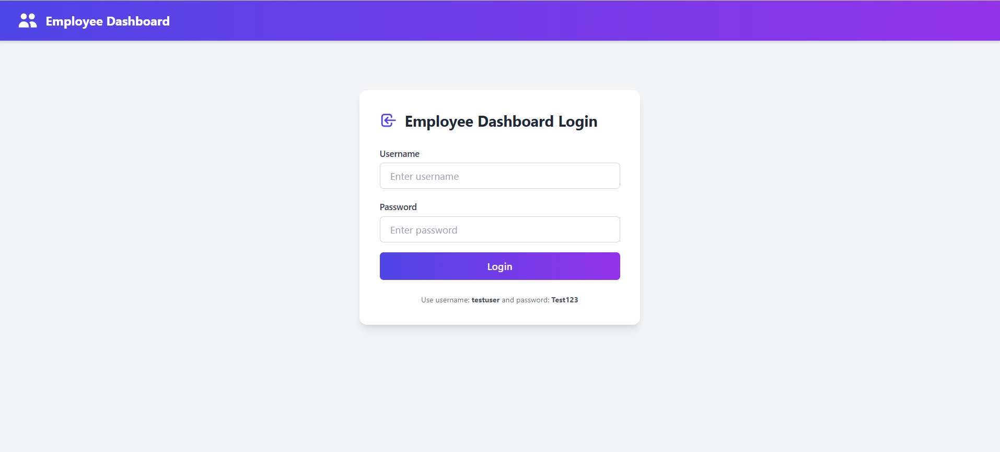
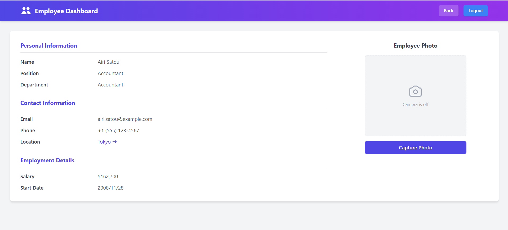
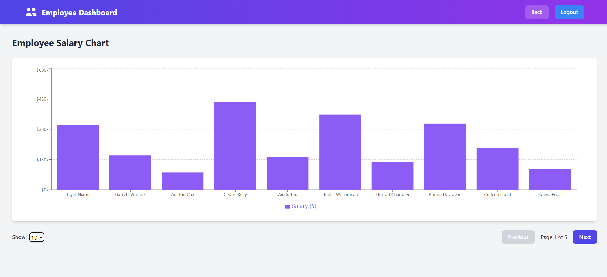
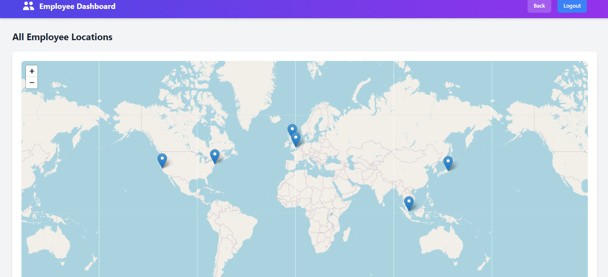
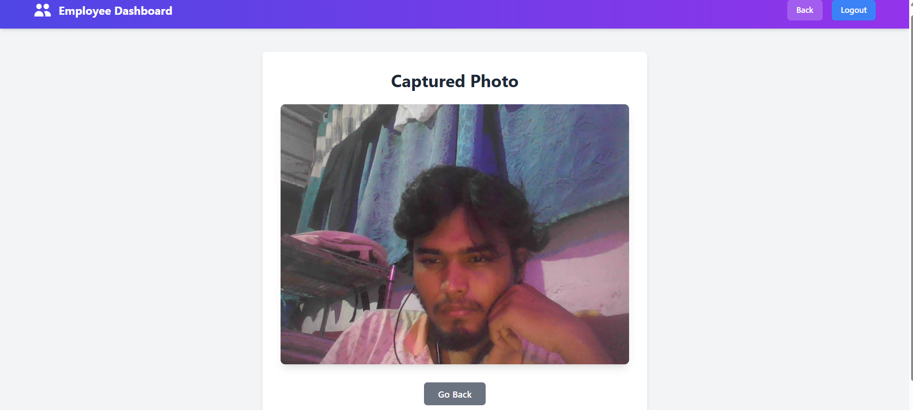
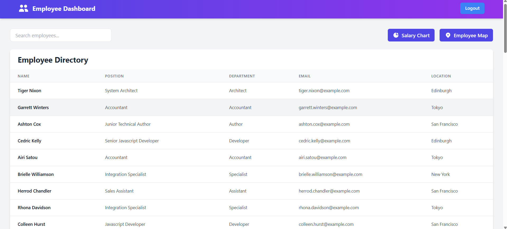

# 🚀 Employee Dashboard - React Application

A modern, responsive employee management dashboard built with React. This application features user authentication, employee data visualization, interactive maps, and smooth animations.

## 📱 Application Demo

### 🎥 Full Video Walkthrough
[](https://www.youtube.com/watch?v=Bg2BA6WiKuw)

*Click the image above to watch the complete application demonstration on YouTube*

## 📸 Application Screenshots (Click to View)

| | |
|:-------------------------:|:-------------------------:|
| [](./public/screenshots/Login.png) <br> **Login Page** <br> *Secure authentication interface* | [](./public/screenshots/Detail.png) <br> **Employee Details** <br> *Detailed employee information view* |
| [](./public/screenshots/Charts.png) <br> **Data Visualization** <br> *Interactive salary charts* | [](./public/screenshots/Maps.png) <br> **Location Mapping** <br> *Interactive employee location map* |
| [](./public/screenshots/PhotoResult.png) <br> **Photo Gallery** <br> *Employee photo gallery* | [](./public/screenshots/List.png) <br> **List of Employee** <br> *Adapts to all screen sizes* |

## ✨ Features

- **🔐 Secure Authentication** - Login/logout functionality with protected routes
- **👥 Employee Directory** - Search, sort, and paginate through employee data
- **📊 Data Visualization** - Interactive charts for salary analysis
- **🗺️ Location Mapping** - Interactive maps with employee locations
- **🖼️ Photo Gallery** - Browse employee photos
- **🎨 Modern UI/UX** - Responsive design with smooth animations
- **⚡ Single Page Application** - Fast navigation without page reloads

## 🛠️ Technologies Used

- **React** - Core JavaScript library for building user interfaces
- **React Router DOM** - Client-side routing and SPA functionality
- **Tailwind CSS** - Utility-first CSS framework for styling
- **Axios** - Promise-based HTTP client for API requests
- **Leaflet & React-Leaflet** - Open-source interactive maps
- **Recharts** - Composable charting library for data visualization
- **Framer Motion** - Production-ready animation library

## 🚀 Getting Started

### Prerequisites
- Node.js (version 14 or higher)
- npm package manager

### Installation & Setup

1. **Clone the repository**:
```bash
git clone https://github.com/your-username/employee-dashboard.git